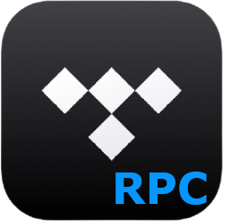

<p align="center">
  
</p>

<h1 align="center">TIDAL RPC</h1>

<p align="center">
  Display your currently playing TIDAL track as Discord Rich Presence on Windows and Android.
</p>

<p align="center">
  
  
  
  <a href="LICENSE">
    
  </a>
</p>

TIDAL RPC is a compact Windows utility that detects the track playing in the official TIDAL desktop app and displays it on your Discord profile with track information, artwork, playback time, and optional buttons.

An Android companion shares playback from the official TIDAL app on your phone.

## Download

Download the latest Windows build from the [Releases page](https://github.com/mousetz/tidalrpc/releases/latest).

1. Download the Windows `.exe` file.
2. Run the application.
3. Complete the TIDAL device sign-in on first launch.
4. Open Discord and play a track through the TIDAL desktop app.

No Python installation is required when using the packaged executable.

For Android 13+, install the APK from a release that includes it. Install the official TIDAL and Discord apps, then grant TIDAL RPC Notification access. The Android app does not require TIDAL sign-in.

## Features

* Detects playing, paused, stopped, and closed TIDAL states.
* Displays the track title, artist, album artwork, and playback duration.
* Optionally displays the artist image and TIDAL buttons.
* Reconnects automatically when Discord opens or restarts.
* Continues running in the Windows system tray when closed.
* Supports starting automatically when you sign in to Windows.
* Stores settings, authentication data, and logs locally.
* Prevents multiple instances of the application from running simultaneously.

## Requirements

* Windows 10 or Windows 11
* The official TIDAL desktop application
* The Discord desktop application
* A TIDAL account for the initial device sign-in

TIDAL and Discord can be opened before or after TIDAL RPC.

## Usage

Launch TIDAL RPC and begin playing a track in the TIDAL desktop app. Once Discord is detected, your Rich Presence will update automatically.

The application window lets you:

* Enable or disable Rich Presence.
* Show an artist image alongside the album artwork.
* Add “Listen on TIDAL” and “Get TIDAL RPC” buttons.
* Start TIDAL RPC automatically when signing in to Windows.

Closing the window hides TIDAL RPC in the system tray. Use the tray menu to reopen the window, toggle Rich Presence, or quit the application.

## How it works

TIDAL RPC uses Windows UI Automation to inspect the title of the official TIDAL desktop window. It retrieves track metadata and uses the Windows media session to keep playback time in sync before updating Discord Rich Presence.

The application does not modify or inject code into either TIDAL or Discord.

Because playback detection depends on the TIDAL desktop window title, major changes to the TIDAL application may temporarily affect detection.

## Troubleshooting

### Waiting for TIDAL

Make sure the official TIDAL desktop application is running and that a track is playing.

### Waiting for Discord

Make sure the Discord desktop application is running. TIDAL RPC will continue attempting to reconnect automatically.

### The application disappeared after closing it

TIDAL RPC continues running in the system tray. Open it by clicking its tray icon or using the tray menu.

### Rich Presence displays incomplete information

Complete the TIDAL device sign-in so the application can retrieve artwork, artist information, duration, and track links.

Diagnostic logs are stored at:

```text
%LOCALAPPDATA%\TIDAL RPC\tidalrpc.log
```

## Development

Python 3.11 is the supported development and build version.

```powershell
git clone https://github.com/mousetz/tidalrpc.git
cd tidalrpc

py -3.11 -m venv .venv
.\.venv\Scripts\Activate.ps1

python -m pip install -r requirements.txt
python main.py
```

The first launch opens TIDAL's device sign-in page.

### Tests

```powershell
py -3.11 -m py_compile main.py ui.py app_settings.py windows_startup.py
py -3.11 -m unittest discover -s tests -v
```

### Build

Before a release, update `version_info.txt` to match the release version. Build the packaged Windows application on Windows:

```powershell
py -3.11 -m PyInstaller --clean --noconfirm tidalrpc.spec
```

The executable will be written to:

```text
dist\TIDAL RPC.exe
```

The packaged application includes the Qt interface and application icons and does not open a console window.

The “Start TIDAL RPC when I sign in” option is intentionally disabled during interpreted development. In packaged builds, it creates a per-user `TIDAL RPC` entry under the Windows `Run` registry key.

## Android

The Android 13+ companion is in [`android/`](android/README.md). It reads TIDAL's media session for track details, artwork when available, and playback timing. See its README for SDK setup, APK build instructions, and notification-access steps.

## Privacy

On Windows, OAuth session data, application settings, and diagnostic logs remain inside the current user's local application-data directory. The Android app stores its settings locally and does not use TIDAL sign-in.

Track information is written to the log only when the detected track changes. Authentication tokens are never intentionally logged.

## Contributing

Bug reports, feature suggestions, and pull requests are welcome through the repository's issue tracker.

When reporting a Windows detection problem, include:

* Your Windows version.
* Your TIDAL desktop app version.
* The relevant section of `tidalrpc.log`.
* A description of the state displayed inside TIDAL RPC.

Do not include authentication tokens or session files.

For Android issues, include your phone model, Android version, and whether Notification access is granted.

## License

TIDAL RPC is available under the [MIT License](LICENSE).

TIDAL RPC is an independent project and is not affiliated with or endorsed by TIDAL or Discord.
